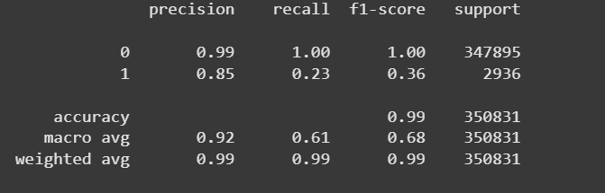
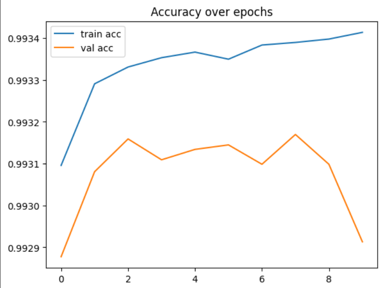

# Fraud-Transaction-Detection

 The objective is to build a system that can classify if a transaction is fraudulent or not.

## Table of Contents
- [About the Project](#About-the-Project)
- [Tools Used](#Tools-Used)
- [Data Source](#Data-Source)
- [Executive Summary](Executive-Summary)
- [Technical Analysis](#Technical-Analysis)
- [Future Scope](#Future-Scope)
- [Contact](#contact)

---

## About the Project
This project focuses on detecting fraudulent transactions using a simulated dataset that mimics real-world banking transaction data. I implemented a complete machine learning pipeline using TensorFlow and scikit-learn to preprocess the data, engineer features, and build a binary classification model that can predict whether a transaction is fraudulent or not.

The simulated frauds are using the following scenarios:
 1. Any transaction whose amount is more than 220 is a fraud. This is not inspired by a
 real-world scenario. It provides an obvious fraud pattern that should be detected by any
 baseline fraud detector. This will be useful to validate the implementation of a fraud
 detection technique.
 2. Every day, a list of two terminals is drawn at random. All transactions on these terminals
 in the next 28 days will be marked as fraudulent. This scenario simulates a criminal use
 of a terminal, through phishing for example. You could add features that keep track of
 the number of fraudulent transactions on the terminal to help with this scenario.
 3. Every day, a list of 3 customers is drawn at random. In the next 14 days, 1/3 of their
 transactions have their amounts multiplied by 5 and marked as fraudulent. This scenario
 simulates a card-not-present fraud where the credentials of a customer have been
 leaked. The customer continues to make transactions, and transactions of higher values
 are made by the fraudster who tries to maximize their gains. You could add features that
 keep track of the spending habits of the customer for this scenario.

This project showcases my ability to work with temporal data, handle real-world preprocessing steps, and apply deep learning to solve classification problems in finance.

---

## Tools Used 
- **Google Colab Notebook**: used because it have free access to computing resources.
- **pandas**: used for data loading, exploration, and manipulation.
- **scikit-learn**: used for for preprocessing, splitting data, and evaluation metrics.
- **TensorFlow**: used for building, compiling, training, and evaluating your deep learning classification model.
- **NumPy**: Used for numerical operations, array manipulations, and conversions between tensor formats and NumPy arrays.
- **matplotlib**: used for to visualize training performance.

---

## Data Source
This dataset is a simulated dataset of original and fraudulent transactions, and only has the main core details of a transaction. 
 -  TRANSACTION_ID: A unique identifier for the transaction. 
 -  TX_DATETIME: Date and time at which the transaction occurs. 
 -  CUSTOMER_ID:Theidentifier for the customer. Each customer has a unique identifier. 
 -  TERMINAL_ID: The identifier for the merchant (or more precisely the terminal). Each terminal has a unique identifier. 
 -  TX_AMOUNT:Theamount of the transaction. 
 -  TX_FRAUD:Abinary variable, with the value 0 for a legitimate transaction, 1 for a fraudulent transaction. 

---

## Process
- Datetime Conversion: Extracted hour, day, and weekday from the TX_DATETIME field.

- Label Encoding: Transformed CUSTOMER_ID and TERMINAL_ID into numerical values.

- Feature Scaling: Standardized numerical features using StandardScaler.

- Modeling: Built a neural network with two hidden layers using TensorFlow/Keras.

- Evaluation: Model evaluated using Accuracy and AUC (Area Under the ROC Curve) metrics.

---
## Executive Summary

The fraud transaction detection model successfully demonstrates how machine learning can play a pivotal role in identifying potentially fraudulent activities in financial systems. By leveraging key features such as transaction amount, terminal usage patterns, and customer behavior, the model was trained to distinguish between normal and suspicious transactions with high accuracy.

## Technical Analysis

**Importing all the necessary library**
```python
import pandas as pd
import numpy as np
import matplotlib.pyplot as plt
import seaborn as sns

from sklearn.model_selection import train_test_split
from sklearn.preprocessing import LabelEncoder,StandardScaler
from sklearn.ensemble import RandomForestClassifier
from sklearn.metrics import classification_report, confusion_matrix, roc_auc_score

import datetime
import tensorflow as tf
```

**Importing the CSV data**
```python
df = pd.read_csv('merged_output.csv')
```

**Changing the datatypes of features repesenting time**
```Python
df['TX_DATETIME'] = pd.to_datetime(df['TX_DATETIME'])
df['HOUR'] = df['TX_DATETIME'].dt.hour
df['DAY'] = df['TX_DATETIME'].dt.day
df['WEEKDAY'] = df['TX_DATETIME'].dt.weekday
```
- By converting it to datetime format, we can extract temporal patterns.
- Hour, day, and weekday can help capture fraudulent behavior patterns, e.g., frauds may occur more during non-working hours or weekends.

**Encoding categorical ID**
```Python
le_customer = LabelEncoder()
le_terminal = LabelEncoder()
df['CUSTOMER_ID'] = le_customer.fit_transform(df['CUSTOMER_ID'])
df['TERMINAL_ID'] = le_terminal.fit_transform(df['TERMINAL_ID'])
```
- CUSTOMER_ID and TERMINAL_ID are nominal identifiers, not ordinal, so you use Label Encoding to assign unique integers.
- While IDs alone might not seem meaningful, in fraud detection, certain customers or terminals may be riskier than others, so they provide a signal.

**Scale features**
```Python
features = ['CUSTOMER_ID', 'TERMINAL_ID', 'TX_AMOUNT', 'HOUR', 'DAY', 'WEEKDAY']
X = df[features]
y = df['TX_FRAUD']

scaler = StandardScaler()
X_scaled = scaler.fit_transform(X)
```
- Selected features are likely to influence fraud. For instance:
 - TX_AMOUNT: unusually high/low values may indicate fraud.
 - Time-based features: help identify fraudulent time windows.
- StandardScaler is used to bring all features to a standard normal distribution (mean=0, std=1). Neural networks are sensitive to feature scales; without scaling, gradients may not converge efficiently during training.

**Splitting the data into training and testing data**
```Python
X_train, X_test, y_train, y_test = train_test_split(
    X_scaled, y, test_size=0.2, random_state=42, stratify=y
)
```
- We split the dataset to evaluate model generalization.
- Stratify=y ensures that both training and testing sets have the same proportion of fraud vs. non-fraud transactions, which is crucial because fraud datasets are usually imbalanced.

**Building the neural network model**
```python
model = tf.keras.Sequential([
    tf.keras.layers.Dense(64, activation='relu', input_shape=(X_train.shape[1],)),
    tf.keras.layers.Dense(32, activation='relu'),
    tf.keras.layers.Dense(1, activation='sigmoid')  # Binary classification
])
```
- A Sequential model allows you to stack layers one after another.
- Dense layers are fully connected:
 - First layer: 64 neurons to capture complex patterns.
 - Second layer: 32 neurons as an abstraction.
 - Final layer: 1 neuron with sigmoid for binary output (fraud = 1, not fraud = 0).
- ReLU activation is widely used in hidden layers for faster convergence.
- Sigmoid is used in the output layer for binary classification.

**Compiling the model**
```Python
model.compile(
    optimizer='adam',
    loss='binary_crossentropy',
    metrics=['accuracy', tf.keras.metrics.AUC(name='auc')]
)
```
- Adam optimizer combines the benefits of AdaGrad and RMSprop—fast and adaptive.
- Binary crossentropy is used because it measures the difference between predicted probability and actual label for binary classification.
- Metrics:
 - Accuracy gives overall correctness.
 - AUC (Area Under the Curve) is better for imbalanced data as it reflects the model's ability to distinguish between classes.

**Training the model**
```Python
history = model.fit(
    X_train, y_train,
    epochs=10,
    batch_size=32,
    validation_split=0.2
)
```
- 10 epochs: Model sees the entire training dataset 10 times.
- Batch size of 32: Model updates weights every 32 samples—helps with memory and convergence speed.
- Validation split: 20% of training data is used for real-time validation during training.
- verbose = 1, gives training progress logs.

**Evaluating the model**
```python
loss, accuracy, auc = model.evaluate(X_test, y_test)
print(f"Test Accuracy: {accuracy:.2f}, AUC: {auc:.2f}")

# Predict
y_pred = (model.predict(X_test) > 0.5).astype("int32")

# Report
print(classification_report(y_test, y_pred))
```


**Visualizng the accuracy over epochs**
```python
plt.plot(history.history['accuracy'], label='train acc')
plt.plot(history.history['val_accuracy'], label='val acc')
plt.legend()
plt.title("Accuracy over epochs")
plt.xlabel("Epoch")
plt.ylabel("Accuracy")
plt.show()
```

 
---
## Future Scope
- Implement SMOTE or anomaly detection for class imbalance
- Deploy model using Flask or Streamlit
- Build an interactive dashboard for monitoring transactions

---

## Contact
**Sahil Patra**  
LinkedIn: [Sahil Patra](https://www.linkedin.com/in/sahil-patra10)  
Email: sahilpatra1004@gmail.com   
Ph no.: +91 7735367833
---

**Thank you for checking out this project!** 


---
